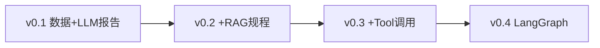

# 小项目设计：表计采集健康小助手（Meter Health Copilot）

> **定位**：第一个边做边学项目。用最小闭环覆盖「调 LLM → 读数据 → 结构化诊断 → API 交付」，再逐步叠 RAG、工具、LangGraph。  
> **与海颐关系**：场景贴近计量/采集运维，数据全部 Mock，不连生产库。

---

## 1. 为什么选这个项目

| 要求 | 本项目如何满足 |
|------|----------------|
| 体量小 | v0.1 约 300～500 行 Python，1 个接口即可演示 |
| 能边做边学 | 每个版本对应学习清单里的理论 + 实践编号 |
| 可扩展 | v0.1 → v0.4 自然长成学习清单中的 P1、P2 |
| 能写简历 | 「能源计量场景 LLM 应用：数据工具 + 结构化诊断报告」 |
| 复用 [A09] 经验 | 有「数据处理管线 + 评测」的熟悉感 |

---

## 2. 用户故事（v0.1 只做前两条）

1. 运维问：「台区 `TQ-10086` 最近采集成功率下降，可能什么原因？」  
2. 系统自动查 Mock 库里的台区、表计、采集成功率，再让大模型生成**带数据依据**的诊断报告（JSON + 自然语言摘要）。  
3. （v0.2）问：「停抄怎么处理？」→ 从规程 FAQ 检索后回答并引用出处。  
4. （v0.3）模型自动决定先查库还是先查 FAQ。  
5. （v0.4）多步流程用 LangGraph 编排，支持「仅建议、不执行写操作」。

---

## 3. 版本路线图



| 版本 | 做什么 | 对应理论 | 对应实践 | 预计体量 |
|------|--------|----------|----------|----------|
| **v0.1** | FastAPI + SQLite Mock + 结构化诊断 | T-3.1～3.3、5 | P-0.4、P-1.1～1.3、P-4.1 | ⭐ 本周 |
| v0.2 | 5 篇 FAQ Markdown + 向量/关键词检索 | T-3.6～3.7 | P-2.1～2.8 | +200 行 |
| v0.3 | Function Calling，模型自选工具 | T-3.8 | P-3.1～3.4 | +150 行 |
| v0.4 | LangGraph 状态机 + 日志追踪 | T-3.8、T-4.2 | P-3.5、P-4.4 | +200 行 |

---

## 4. v0.1 功能范围（严格边界）

### 4.1 包含

- `POST /diagnose`：入参 `question`（自然语言，含台区编号更佳）
- 从问题中**正则提取**台区 ID（如 `TQ-10086`）
- 查询 SQLite：`districts`、`meters`、`collect_daily`
- 将查询结果填入 Prompt，调用大模型（无 Key 时走 **Mock 模式**）
- 返回：`DiagnoseResponse`（结构化 JSON + `summary` 文本）

### 4.2 不包含（留给后续版本）

- 向量库、LangGraph、真实 Java 对接、用户权限、前端页面

---

## 5. 数据模型（Mock）

**台区 `districts`**

| 字段 | 示例 |
|------|------|
| district_id | TQ-10086 |
| name | 某某台区 |
| meter_count | 120 |

**表计 `meters`（抽样）**

| 字段 | 示例 |
|------|------|
| meter_id | M-001 |
| district_id | TQ-10086 |
| status | normal / stop_collect / clock_error |

**日采集 `collect_daily`**

| 字段 | 示例 |
|------|------|
| district_id | TQ-10086 |
| stat_date | 2026-05-28 |
| success_rate | 0.72 |
| fail_count | 34 |

种子数据内置 2 个台区：一个正常、一个成功率偏低，便于对比测试。

---

## 6. API 设计

### 请求

```json
POST /diagnose
{
  "question": "台区 TQ-10086 采集成功率下降可能什么原因？"
}
```

### 响应（示例结构）

```json
{
  "district_id": "TQ-10086",
  "summary": "一段话摘要…",
  "health_level": "warning",
  "metrics": {
    "latest_success_rate": 0.72,
    "stat_date": "2026-05-28",
    "stop_collect_count": 5,
    "clock_error_count": 2
  },
  "possible_causes": ["…"],
  "recommended_actions": ["…"],
  "evidence": ["数据：2026-05-28 成功率 72%…"],
  "llm_mode": "mock"
}
```

---

## 7. 目录结构

```
meter-copilot/
├── README.md
├── requirements.txt
├── .env.example
├── app/
│   ├── main.py          # FastAPI 入口
│   ├── schemas.py       # Pydantic 模型
│   ├── db.py            # SQLite 初始化与查询
│   ├── extractor.py     # 从问题中提取台区 ID
│   ├── diagnose.py      # 诊断编排（v0.1 线性）
│   ├── llm.py           # 大模型调用 + Mock
│   └── prompts/
│       └── diagnose_system.txt
└── data/                # v0.2 放 FAQ markdown
```

---

## 8. v0.1 学习与验收

### 8.1 边做边学对照

| 步骤 | 你学会什么 |
|------|------------|
| 搭 FastAPI | HTTP API、Pydantic 校验 |
| 写 SQLite 查询 | SQL 聚合、参数化 |
| 写 System Prompt | 角色、边界、禁止编造 |
| JSON 输出 | Schema、解析失败处理 |
| Mock LLM | 无 Key 也能开发调试 |
| 跑通 curl | 端到端交付意识 |

### 8.2 验收清单

- [ ] `uvicorn app.main:app --reload` 启动成功  
- [ ] `GET /health` 返回 ok  
- [ ] 问 `TQ-10086` 返回 **warning** 且 metrics 含 72%  
- [ ] 问 `TQ-10001`（正常台区）返回 **normal**  
- [ ] 问不含台区 ID 时返回友好提示，不胡编数据  
- [ ] 配置 `OPENAI_API_KEY` 或兼容 API 后 `llm_mode=live`  

### 8.3 建议自测问题

1. `台区 TQ-10086 采集成功率下降可能什么原因？`  
2. `TQ-10001 有没有异常？`  
3. `今天天气怎么样？`（应拒绝或说明超出范围）

---

## 9. 环境变量

| 变量 | 说明 |
|------|------|
| `LLM_API_KEY` | 大模型 API Key（可选） |
| `LLM_BASE_URL` | 兼容 OpenAI 的 base URL |
| `LLM_MODEL` | 如 `deepseek-chat`、`qwen-plus` |
| `LLM_MOCK` | `true` 时强制 Mock（默认无 Key 即 Mock） |

---

## 10. 下一步（完成 v0.1 后）

1. **v0.2**：在 `data/faq/` 放 5 个 `.md`（停抄、时钟超差、线损异常等），实现 `/ingest` + 检索后再 `/diagnose`。  
2. 把 v0.1 评测的 3 个问题扩成 20 条的 `eval/questions.json`。  
3. 截图 + README 进 GitHub，简历写一条。

---

*配套代码目录：`/workspace/meter-copilot/`（v0.1 骨架）*
